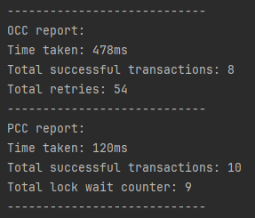

# **Performance Analysis Report: Optimistic vs. Pessimistic Concurrency Control**

## **📝 Student Names: Oskar, Peter og Yusuf**

---

## **📌 Introduction**

### **Objective:**

This report analyzes and compares the performance of **Optimistic Concurrency Control (OCC) vs. Pessimistic Concurrency Control (PCC)** when handling concurrent transactions in an Esports Tournament database.

### **Scenario Overview:**

- **OCC is tested** by simulating multiple players registering for the same tournament concurrently.
- **PCC is tested** by simulating multiple administrators updating the same match result simultaneously.

---

## **📌 Experiment Setup**

### **Database Schema Used:**

```sql
CREATE TABLE players (
    player_id SERIAL PRIMARY KEY,
    username VARCHAR(50) UNIQUE NOT NULL,
    email VARCHAR(100) UNIQUE NOT NULL,
    ranking INT DEFAULT 0,
    created_at TIMESTAMP DEFAULT CURRENT_TIMESTAMP
);

CREATE TABLE tournaments (
    tournament_id SERIAL PRIMARY KEY,
    name VARCHAR(100) NOT NULL,
    game VARCHAR(50) NOT NULL,
    max_players INT NOT NULL,
    start_date TIMESTAMP NOT NULL,
    created_at TIMESTAMP DEFAULT CURRENT_TIMESTAMP
);

CREATE TABLE tournament_registrations (
    registration_id SERIAL PRIMARY KEY,
    tournament_id INT NOT NULL,
    player_id INT NOT NULL,
    registered_at TIMESTAMP DEFAULT CURRENT_TIMESTAMP,
    FOREIGN KEY (tournament_id) REFERENCES tournaments(tournament_id) ON DELETE CASCADE,
    FOREIGN KEY (player_id) REFERENCES players(player_id) ON DELETE CASCADE,
);

CREATE TABLE matches (
    match_id SERIAL PRIMARY KEY,
    tournament_id INT NOT NULL,
    player1_id INT NOT NULL,
    player2_id INT NOT NULL,
    winner_id INT NULL,
    match_date TIMESTAMP NOT NULL,
    FOREIGN KEY (tournament_id) REFERENCES tournaments(tournament_id) ON DELETE CASCADE,
    FOREIGN KEY (player1_id) REFERENCES players(player_id) ON DELETE CASCADE,
    FOREIGN KEY (player2_id) REFERENCES players(player_id) ON DELETE CASCADE,
    FOREIGN KEY (winner_id) REFERENCES players(player_id) ON DELETE SET NULL
);

ALTER TABLE tournaments ADD COLUMN version INT NOT NULL DEFAULT 1;
```

### **Concurrency Control Techniques Implemented:**

- **Optimistic Concurrency Control (OCC)** using a **version column** in the `Tournaments` table.
- **Pessimistic Concurrency Control (PCC)** using `SELECT ... FOR UPDATE` when updating `Matches`.

### **Test Parameters:**

| Parameter                             | Value              |
| ------------------------------------- | ------------------ |
| **Number of concurrent transactions** | 10                 |
| **Database**                          | PostgreSQL         |
| **Execution Environment**             | Localhost / Docker |
| **Java Thread Pool Size**             | 10                 |

---

## **📌 Results & Observations**

### **1️⃣ Optimistic Concurrency Control (OCC) Results**

**Test Scenario:** We try to add 10 players to the same tournament concurrently, where the tournament has a maximum capacity of 8 players.

| **Metric**                                | **Value** |
| ----------------------------------------- | --------- |
| Execution Time (ms)                       | 478ms     |
| Number of successful transactions         | 8         |
| Number of retries due to version mismatch | 54        |

**Observations:**

- We only see 8 successful transactions out of 10 due to the maximum capacity of the tournament.
- The version mismatch caused 54 retries, which increased the execution time.

---

### **2️⃣ Pessimistic Concurrency Control (PCC) Results**

**Test Scenario:** We try to update the same match result 10 times concurrently.

| **Metric**                                           | **Value** |
| ---------------------------------------------------- | --------- |
| Execution Time (ms)                                  | 120ms     |
| Number of successful transactions                    | 10        |
| Number of transactions that had to wait due to locks | 9         |

**Observations:**

- All 10 transactions were successful, they just had to wait their turn due to the locks.

---

## **📌 Comparison Table**

| **Metric**               | **Optimistic CC** | **Pessimistic CC** |
| ------------------------ | ----------------- | ------------------ |
| **Execution Time**       | 478ms             | 120ms              |
| **Transaction Failures** | 2 (retries)       | 0                  |
| **Lock Contention**      | Low               | High               |
| **Best Use Case**        | Reading data      | Inserting data     |

---

## **Performance Comparison Chart**

_You *may* want to visualize your finding by including a chart that illustrates the differences in execution time, successful transactions, and transactions with delays for OCC vs. PCC._



---

## **📌 Conclusion & Recommendations**

### **Key Findings:**

- **Optimistic Concurrency Control (OCC)** is better suited for scenarios where conflicts are rare, and the cost of retries is low.
- **Pessimistic Concurrency Control (PCC)** is better suited for scenarios where conflicts are common, and the cost of waiting is low.

### **Final Recommendations:**

- **Use OCC** when you have a high read-to-write ratio and low contention.
- **Use PCC** when you have a high write-to-read ratio and high contention.
