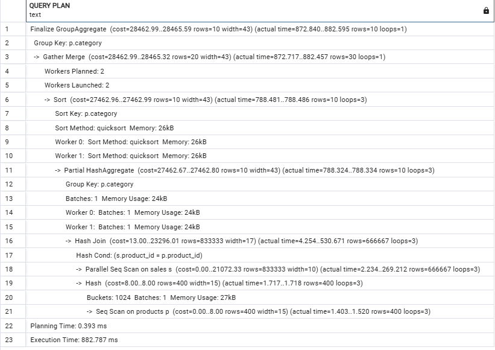

# Query Optimization


Scripts for the exercises 1, 2, and 3:
We have made a little database for this task and added som dummy data to it.

```sql
-- Create the Customers table
CREATE TABLE Customers (
    customer_id SERIAL PRIMARY KEY,
    name VARCHAR(255) NOT NULL
);

-- Create the Orders table
CREATE TABLE Orders (
    order_id SERIAL PRIMARY KEY,
    customer_id INT REFERENCES Customers(customer_id),
    total_amount NUMERIC(10, 2) NOT NULL,
    order_date DATE NOT NULL
);
```

```sql
INSERT INTO Customers (name) VALUES
('Alice Johnson'),
('Bob Smith'),
('Charlie Davis'),
('Diana Evans'),
('Ethan Harris'),
('Fiona Clark'),
('George Lewis'),
('Hannah Walker'),
('Ian Martinez'),
('Julia Roberts');
```

```sql
DO $$
DECLARE
    customer_count INTEGER := 10;
    order_count INTEGER := 1000;
    i INTEGER;
    random_customer_id INTEGER;
    random_total_amount NUMERIC(10, 2);
    random_order_date DATE;
BEGIN
    FOR i IN 1..order_count LOOP
        random_customer_id := (i % customer_count) + 1;
		random_total_amount := ROUND((RANDOM() * 990 + 10)::numeric, 2);
        random_order_date := DATE '2025-03-17' - (TRUNC(RANDOM() * 365)::INTEGER); -- Random date within the past year
        INSERT INTO Orders (customer_id, total_amount, order_date)
        VALUES (random_customer_id, random_total_amount, random_order_date);
    END LOOP;
END $$;
```

## Exercise 1

The slow query:

```sql
EXPLAIN ANALYZE SELECT order_id, total_amount,
       (SELECT name FROM Customers WHERE customer_id = Orders.customer_id) AS customer_name
FROM Orders
WHERE total_amount > 100;
```


The optimized query:

```sql
EXPLAIN ANALYZE SELECT order_id, total_amount, c.name AS customer_name
FROM Orders
JOIN Customers c ON Orders.customer_id = c.customer_id
WHERE total_amount > 100;
```


We can see that the execution time for the omptimized query (~34 ms) is much faster than the slow query (~157 ms). We can also see that is went through 50888 rows one time on the orders table and 10 rows on the customer table.

## Exercise 2

```sql
EXPLAIN ANALYZE SELECT o.order_id, o.total_amount, c.name
FROM Orders o
JOIN Customers c ON o.customer_id = c.customer_id
WHERE o.order_date > '2023-01-01';
```


We have created an index on customer_id to optimize the query.

```sql
CREATE INDEX idx_order_customer_id ON Orders(customer_id);
```

We can now run the query again and see the difference.


There is not a big difference in the execution time (~1 ms), this is more then likely because the data set is so small. But in a larger data set the difference would be more noticable. How ever we can se that the query is now using index scan insted of sequential scan on customer_id.

## Exercise 3

The N+1 Query Problem happens when a query is executed to fetch a list of entities, and then for each entity, another query is executed to fetch related entities. This results in N+1 queries being executed, where N is the number of entities fetched in the first query.

The N+1 Query:

```sql
-- Fetch all orders first
SELECT order_id, customer_id FROM Orders WHERE order_date > '2023-01-01';

-- Then, for each order, fetch customer name separately
SELECT name FROM Customers WHERE customer_id = 1;
SELECT name FROM Customers WHERE customer_id = 2;
SELECT name FROM Customers WHERE customer_id = 3;
...
```

The rewiten query:

```sql
SELECT o.order_id, c.customer_id, c.name AS customer_name
FROM Orders o
JOIN Customers c on o.customer_id = c.customer_id
WHERE o.order_date > '2023-01-01';
```

In stead of running two separate queries we have joined the two tables and fetched the customer name in the same query.

## Exercise 4

Script for inserting data into the database (ran this 4 times): 
```sql
-- Insert 100 products into the Products table
INSERT INTO Products (name, category, price)
SELECT
    'Product ' || gs AS name,
    'Category ' || (1 + (gs % 10)) AS category,
    ROUND((RANDOM() * 90 + 10)::numeric, 2) AS price
FROM generate_series(1, 100) AS gs;

-- Insert 500,000 sales into the Sales table
INSERT INTO Sales (product_id, quantity, sale_date, total_amount)
SELECT
    (1 + FLOOR(RANDOM() * 100))::int AS product_id,
    (1 + FLOOR(RANDOM() * 10))::int AS quantity,
    DATE '2022-01-01' + (FLOOR(RANDOM() * 730) || ' days')::INTERVAL AS sale_date,
    ROUND(((RANDOM() * 90 + 10) * (1 + FLOOR(RANDOM() * 10)))::numeric, 2) AS total_amount
FROM generate_series(1, 500000) AS gs;
```

### Task 1



We can see its set planned workers to 2 and workers launced to 2 which means including the main worker there are a total of 3 workers. So for each worker there are 666.667 rows (total 2.000.000) to process on the Sales table and 400 rows (total 1200) on the Products table.

Furthermore we can observe that the out says Parallel Sequential Scan instead of index scan and also there are bebing used Sequential scan on products which tells us that there are no index used for filtering or joining.

### Task 2

```sql
SELECT schemaname, indexname, indexdef
FROM pg_indexes
WHERE tablename = 'Sales';
```


We have verified that at this moment there are no indexes on the Sales table.

### Task 3

We have add the following indexes to the database:

```sql
CREATE INDEX idx_product_id ON Sales(product_id);
CREATE INDEX idx_category ON Products(category);
```

Then we run the following query:

```sql
EXPLAIN ANALYZE SELECT p.category, SUM(s.total_amount) AS total_sales
FROM Sales s
JOIN Products p ON s.product_id = p.product_id
GROUP BY p.category;
```


First of all the execution time became worse, went from ~882 ms to ~1420 ms.

We can see that it is using index scan for the products table and the index scan for the sales table; however it seem as its still scanning the full 2.000.000 rows in the sales table and 1200 rows in the products table.

### Task 4

```sql
CREATE INDEX idx_sales_optimized ON Sales(product_id, total_amount);
```


We can see that the query is now using the covering index `idx_sales_optimized` and after adding this covering index the execution time went down to ~662 ms.
