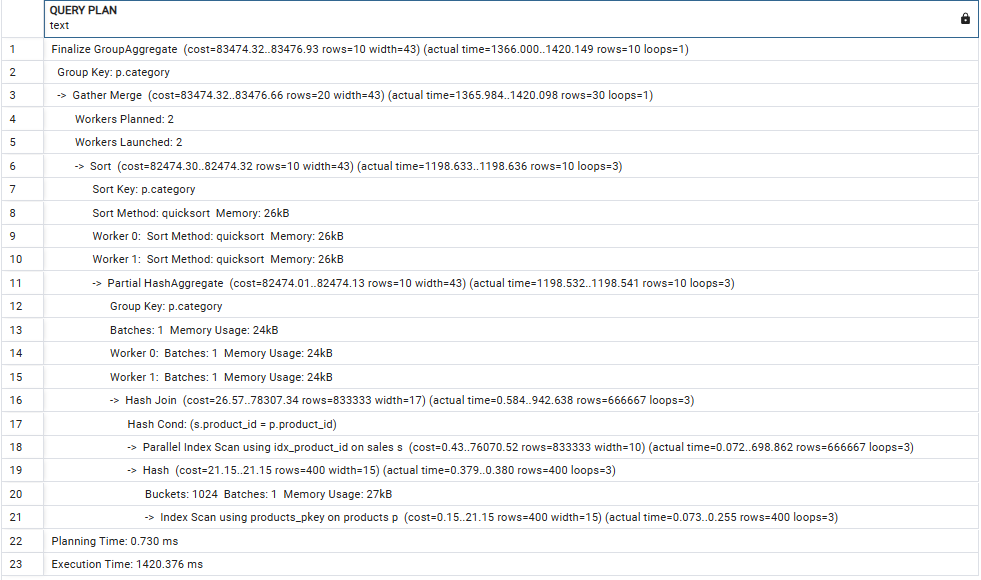

# Query Optimization

## Exercise 1

The slow query:
```sql
SELECT order_id, total_amount,
       (SELECT name FROM Customers WHERE customer_id = Orders.customer_id) AS customer_name
FROM Orders
WHERE total_amount > 100;
```

The optimized query:
```sql
SELECT order_id, total_amount, c.name AS customer_name
FROM Orders
JOIN Customers c ON Orders.customer_id = c.customer_id
WHERE total_amount > 100;
```
We have optimized the query be removing the subquery and instead using a Join to fetch the customer name. 

Know we can use Explain to verify the index usage and scan the rows.
```sql
EXPLAIN SELECT order_id, total_amount, c.name AS customer_name
FROM Orders
JOIN Customers c ON Orders.customer_id = c.customer_id
WHERE total_amount > 100;
```

TODO: foto to explain index usage and row scans.

## Exercise 2

We have made a little database for this task and added som dummy data to it.

```sql
-- Create the Customers table
CREATE TABLE Customers (
    customer_id SERIAL PRIMARY KEY,
    name VARCHAR(255) NOT NULL
);

-- Create the Orders table
CREATE TABLE Orders (
    order_id SERIAL PRIMARY KEY,
    customer_id INT REFERENCES Customers(customer_id),
    total_amount NUMERIC(10, 2) NOT NULL,
    order_date DATE NOT NULL
);
```

```sql
INSERT INTO Customers (name) VALUES
('Alice Johnson'),
('Bob Smith'),
('Charlie Davis'),
('Diana Evans'),
('Ethan Harris'),
('Fiona Clark'),
('George Lewis'),
('Hannah Walker'),
('Ian Martinez'),
('Julia Roberts');
```

```sql
DO $$
DECLARE
    customer_count INTEGER := 10;
    order_count INTEGER := 1000;
    i INTEGER;
    random_customer_id INTEGER;
    random_total_amount NUMERIC(10, 2);
    random_order_date DATE;
BEGIN
    FOR i IN 1..order_count LOOP
        random_customer_id := (i % customer_count) + 1;
		random_total_amount := ROUND((RANDOM() * 990 + 10)::numeric, 2);
        random_order_date := DATE '2025-03-17' - (TRUNC(RANDOM() * 365)::INTEGER); -- Random date within the past year
        INSERT INTO Orders (customer_id, total_amount, order_date)
        VALUES (random_customer_id, random_total_amount, random_order_date);
    END LOOP;
END $$;
```

```sql
EXPLAIN SELECT o.order_id, o.total_amount, c.name
FROM Orders o
JOIN Customers c ON o.customer_id = c.customer_id
WHERE o.order_date > '2023-01-01';
```


We have created an index on order_date to optimize the query.

```sql
CREATE INDEX idx_order_order_date ON Orders(order_date);
```

We can now run the query again and see the difference.


## Exercise 3

The N+1 Query Problem happens when a query is executed to fetch a list of entities, and then for each entity, another query is executed to fetch related entities. This results in N+1 queries being executed, where N is the number of entities fetched in the first query.

```sql
SELECT o.order_id, c.customer_id, c.name AS customer_name
FROM Orders o
JOIN Customers c on o.customer_id = c.customer_id
WHERE o.order_date > '2023-01-01';
```

## Exercise 4

```sql
-- Insert 100 products into the Products table
INSERT INTO Products (name, category, price)
SELECT
    'Product ' || gs AS name,
    'Category ' || (1 + (gs % 10)) AS category,
    ROUND((RANDOM() * 90 + 10)::numeric, 2) AS price
FROM generate_series(1, 100) AS gs;

-- Insert 500,000 sales into the Sales table
INSERT INTO Sales (product_id, quantity, sale_date, total_amount)
SELECT
    (1 + FLOOR(RANDOM() * 100))::int AS product_id,
    (1 + FLOOR(RANDOM() * 10))::int AS quantity,
    DATE '2022-01-01' + (FLOOR(RANDOM() * 730) || ' days')::INTERVAL AS sale_date,
    ROUND(((RANDOM() * 90 + 10) * (1 + FLOOR(RANDOM() * 10)))::numeric, 2) AS total_amount
FROM generate_series(1, 500000) AS gs;
```

### Task 1


### Task 2

```sql
SELECT schemaname, indexname, indexdef
FROM pg_indexes
WHERE tablename = 'Sales';
```


### Task 3

```sql
SELECT p.category, SUM(s.total_amount) AS total_sales
FROM Sales s
JOIN Products p ON s.product_id = p.product_id
GROUP BY p.category;
```



```sql
CREATE INDEX idx_product_id ON Sales(product_id);
CREATE INDEX idx_category ON Products(category);
```


### Task 4

```sql
CREATE INDEX idx_sales_optimized ON Sales(product_id, total_amount);
```


